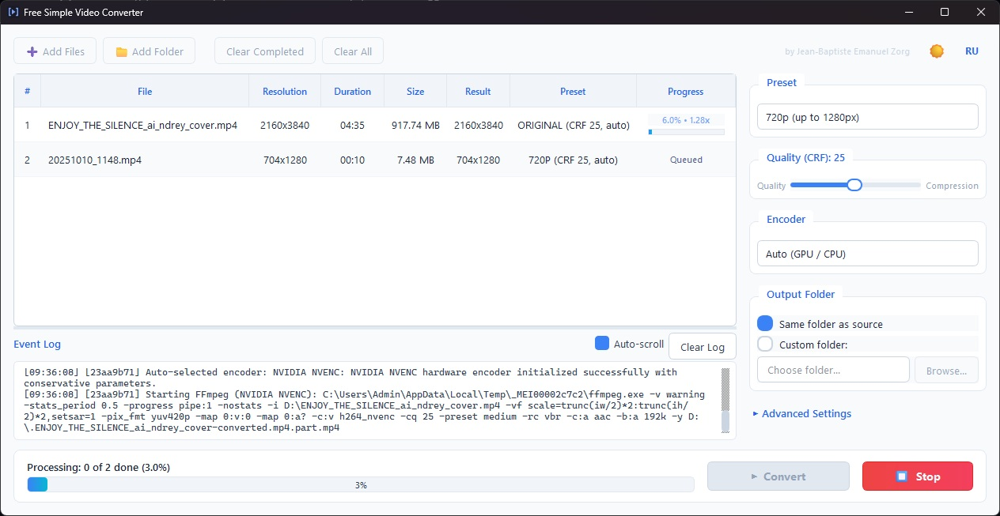

# Free Simple Video Converter

[Русская версия](README_RU.md)

Batch video conversion with resolution presets and hardware encoding support.



## Features

- **Batch processing** — add individual video files or folders, including their subfolders.
- **Resolution presets** — **Original**, **480p**, **720p**, **1080p**, **2K**, and **4K**. The selected preset sets the maximum output resolution. Files below that resolution keep their original resolution.
- **Encoding** — `libx264` software encoding everywhere; hardware acceleration where drivers allow it (Windows: NVIDIA NVENC, Intel Quick Sync, AMD AMF; Linux: NVIDIA NVENC, Intel Quick Sync / VAAPI, AMD VAAPI).
- **Output options** — frame rate, audio bitrate, output folder, and automatic filename numbering.
- **Interface** — light and dark themes; English and Russian interface languages.

## System requirements

- **Windows**: Windows 10 64-bit or newer.
- **Linux**: Ubuntu 22.04 or newer (or a compatible distribution), x86_64.
- **Hardware acceleration** (optional): NVIDIA GPU with a recent driver for NVENC; Intel GPU with media drivers for Quick Sync / VAAPI; AMD GPU with Mesa VAAPI drivers (Linux) or the AMF runtime (Windows).

## Supported input files

The queue accepts `.mp4`, `.mkv`, `.avi`, `.mov`, `.wmv`, `.asf`, `.wm`, `.wma`, `.flv`, `.webm`, `.m4v`, `.ts`, `.mts`, `.m2ts`, `.3gp`, `.vob`, and `.ogv` files. When a folder is added, matching files are found in its subfolders as well.

## Download and quick start

Download the archive from the repository's **Releases** page. On Windows, extract it and run `FreeSimpleVideoConverter.exe`; installation is not required. On Linux (Ubuntu 22.04+ x86_64), extract the `linux-x86_64.tar.gz` archive and run `./FreeSimpleVideoConverter`, or make the `linux-x86_64.AppImage` executable (`chmod +x`) and run it directly.

Add files or a folder, select a preset and encoder, choose the output location, and start conversion. The queue shows progress for each file; the event log contains conversion details.

## Run from source

```powershell
git clone https://github.com/pazzany/Free-Simple-Video-Converter.git
cd Free-SimpleVideo-Converter
python -m venv .venv
.\.venv\Scripts\Activate.ps1
pip install -e ".[dev]"
python -m video_converter
```

On Linux:

```bash
git clone https://github.com/pazzany/Free-Simple-Video-Converter.git
cd Free-SimpleVideo-Converter
python3 -m venv .venv
source .venv/bin/activate
pip install -e ".[dev]"
python -m video_converter
```

## Build the standalone executable

The development build expects matching `ffmpeg.exe` and `ffprobe.exe` in the local ignored `bin/` directory. Then run:

```powershell
python packaging/build_exe.py
```

The portable executable is written to `dist/FreeSimpleVideoConverter.exe`.

On Linux, place matching `ffmpeg` and `ffprobe` in a `bin/` directory and run `python packaging/build_linux_app.py --repo-root . --bin-dir bin --manifest packaging/ffmpeg_artifact_manifest_linux.json --dist-dir dist-linux --work-dir build-linux` to produce the application tarball.

## Conversion behavior

The application creates MP4 output files. A temporary `.part.mp4` file is used while conversion is in progress, so incomplete output does not replace the final file. Aspect ratio is preserved and output dimensions are kept even.

On Windows, the bundled media engine is a custom FFmpeg 6.1.1 UCRT64 build; on Linux (Ubuntu 22.04+ x86_64), it is a custom FFmpeg 6.1.1 build with NVENC, QSV, and VAAPI support. Hardware encoding depends on the installed device and drivers. Application settings are stored in `%LOCALAPPDATA%/FreeSimpleVideoConverter/config.json` on Windows and `~/.config/FreeSimpleVideoConverter/config.json` on Linux.

## License and notices

This project is released under the [MIT License](LICENSE). See [Third-Party Notices](THIRD_PARTY_NOTICES.md) for bundled-component licenses and attribution.

The matching-source delivery process for the custom FFmpeg build is documented in the [FFmpeg source release checklist](packaging/FFMPEG_SOURCE_RELEASE_CHECKLIST.md). The project workflow was originally inspired by [orex2121/Video-Compres-StableDif](https://github.com/orex2121/Video-Compres-StableDif).
