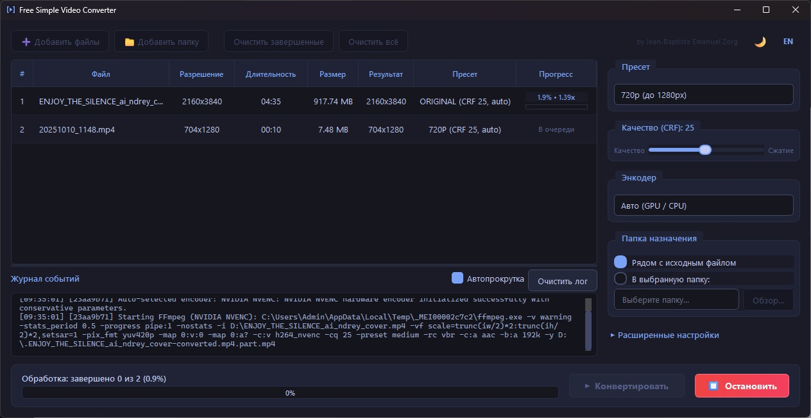

# Free Simple Video Converter

[English version](README.md)

Пакетная конвертация видеофайлов с пресетами разрешения и поддержкой аппаратного кодирования.



## Возможности

- **Пакетная обработка** — добавление отдельных видеофайлов или папок вместе с вложенными каталогами.
- **Пресеты разрешения** — **Original**, **480p**, **720p**, **1080p**, **2K** и **4K**. Выбранный пресет задаёт максимальное разрешение выходного файла. Если исходное разрешение ниже, оно сохраняется без увеличения.
- **Кодирование** — NVIDIA NVENC, Intel Quick Sync, AMD AMF и программное кодирование через `libx264`.
- **Параметры вывода** — частота кадров, аудиобитрейт, папка сохранения и автоматическая нумерация файлов.
- **Интерфейс** — светлая и тёмная темы, русский и английский языки.

## Поддерживаемые входные файлы

Очередь принимает файлы `.mp4`, `.mkv`, `.avi`, `.mov`, `.wmv`, `.asf`, `.wm`, `.wma`, `.flv`, `.webm`, `.m4v`, `.ts`, `.mts`, `.m2ts`, `.3gp`, `.vob` и `.ogv`. При добавлении папки программа также находит подходящие файлы во вложенных каталогах.

## Загрузка и быстрый старт

Скачайте архив на странице **Releases** репозитория. Распакуйте его и запустите `FreeSimpleVideoConverter.exe`; установка не требуется.

Добавьте файлы или папку, выберите пресет и энкодер, укажите папку для результата и запустите конвертацию. Очередь показывает прогресс каждого файла, а журнал событий содержит сведения о конвертации.

## Запуск из исходников

```powershell
git clone https://github.com/pazzany/Free-Simple-Video-Converter.git
cd Free-Simple-Video-Converter
python -m venv .venv
.\.venv\Scripts\Activate.ps1
pip install -e ".[dev]"
python -m video_converter
```

## Сборка автономного приложения

Для development-сборки нужны соответствующие `ffmpeg.exe` и `ffprobe.exe` в локальной игнорируемой папке `bin/`. Затем выполните:

```powershell
python packaging/build_exe.py
```

Портативный EXE будет создан по пути `dist/FreeSimpleVideoConverter.exe`.

## Поведение конвертации

Приложение создаёт MP4-файлы. Во время конвертации используется временный файл `.part.mp4`, поэтому незавершённый результат не заменяет итоговый файл. Пропорции сохраняются, а размеры выходного файла остаются чётными.

Встроенный медиа-движок — custom FFmpeg 6.1.1 UCRT64 build. Аппаратное кодирование зависит от установленного устройства и драйверов. Настройки приложения хранятся в `%LOCALAPPDATA%/FreeSimpleVideoConverter/config.json`.

## Лицензия и уведомления

Проект распространяется по [лицензии MIT](LICENSE). Сведения о лицензиях встроенных компонентов и атрибуции приведены в [уведомлениях о сторонних компонентах](THIRD_PARTY_NOTICES.md).

Процесс предоставления соответствующих исходных текстов для custom FFmpeg build описан в [контрольном списке source release FFmpeg](packaging/FFMPEG_SOURCE_RELEASE_CHECKLIST.md). Исходный рабочий процесс проекта был вдохновлён [orex2121/Video-Compres-StableDif](https://github.com/orex2121/Video-Compres-StableDif).
